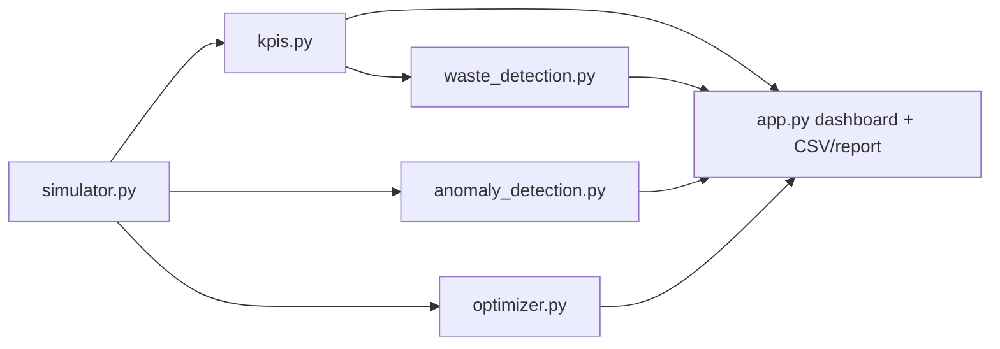

# AI-Based Industrial Energy Waste Detection and Optimization System
Software-based industrial energy simulation and optimization **prototype**. All data is **simulated**; all savings are **estimates** from model assumptions. Not a validated digital twin.

## Run
```
pip install -r requirements.txt
python -m pytest -q
streamlit run app.py
```
## Architecture

## Equations
- Energy (kWh) = P (kW) x 0.25 h per step; Peak demand = max_t sum_m P_m(t); Avg power = mean_t sum_m P_m(t)
- Idle energy = sum of E where status = Idle (idle power = idle% x rated kW); Intensity = kWh / units; Cost = sum(kWh x tariff)
- Avoidable idle energy = idle energy x avoidable fraction (assumption)
## Data dictionary
timestamp, machine, rated_kw, scheduled, status (Running/Idle/Off), power_kw, energy_kwh, production_units, injected_anomaly, anomaly_type (spike / after_hours_idle), data_source (=SIMULATED), price, cost.
## Assumptions and limitations
See in-app "Engineering Concepts" and `src/simulator.py`. Only 15-min steps, daily windows (no overnight shifts), simplified power model, tariffs illustrative.
## Optimizer
Per flexible machine: keep the same number of running steps, place them in the cheapest tariff steps inside the shift window; reduce idle draw by a configurable %. Constraints are checked by `check_constraints`.
## Interview Q&A
- *kW vs kWh?* Power rate vs energy accumulated over time. - *Why peak demand?* Utilities size capacity/charges on it.
- *Why Isolation Forest?* Unsupervised, no labels needed; here labels exist only because we simulated them.
- *Are the savings real?* No; relative to a modeled baseline only.
